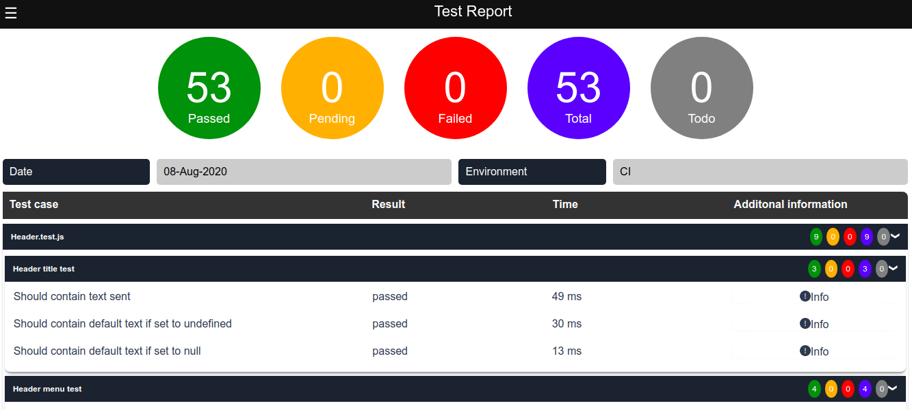

## Jest Html Reporter


[](https://www.npmjs.com/package/htmlreport4jest 'View this project on npm')
[](https://github.com/semantic-release/semantic-release)

Jest reporter to generate hierarchical html report

### Installation

---
Install with npm
```shell
  npm install htmlreport4jest --save-dev
```

Install with yarn
```shell
  yarn add htmlreport4jest --dev
```

### Usage

---

Configure Jest to process the test results by adding the following entry to the Jest config (jest.config.json or jest.config.js):

```json
"jest": {
  ...,
  "reporters": [
    "default",
    "htmlreport4jest"
  ],
  ...
}

```

Executing the jest tests with above configuration will create a `result.html` under temp folder inside the project root. Test report can be configured with below options.

### Available Options

The options below are specific to the reporter.

| Option Name   | Type    | Default                  | Description                                                                                                                                                                                                                                                                                          |
| :------------ | :------ | :----------------------- | :--------------------------------------------------------------------------------------------------------------------------------------------------------------------------------------------------------------------------------------------------------------------------------------------------- |
| `title`  | string  | 'Jest Html Report'                       | Title of the generated html report                                                                                                                                                                                                                                                                                |
| `reportPath`    | string  | './temp/' | Generated html file will be stored under the given path                                                                                                                                                                                                                                |
| `reportFileName`      | string | 'result.html'                    | Name of the html report to be generated     |
| `hideMenu`      | boolen | false                    | Hides filter menu                                                         
| `expandResults`      | boolen | false                    | Expand result tabs in report                                                         
| `expandMenuItems`      | boolen | false                    | Expand menu nodes in menu                           

#### example add config options

```json
...,
"reporters": [
  "default",
  ["htmlreport4jest", {
    "title": 'Jest Html Report',
    "reportPath": './temp/',
    "reportFileName": 'result.html',
    "hideMenu": true
  }]
]
```

### Sample report

